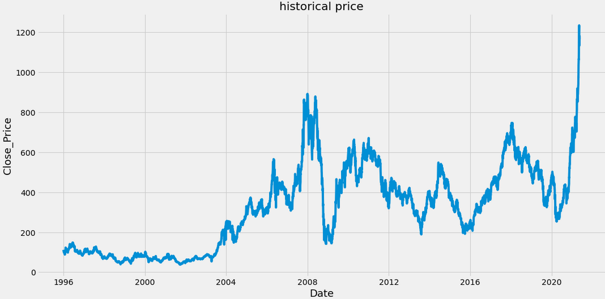
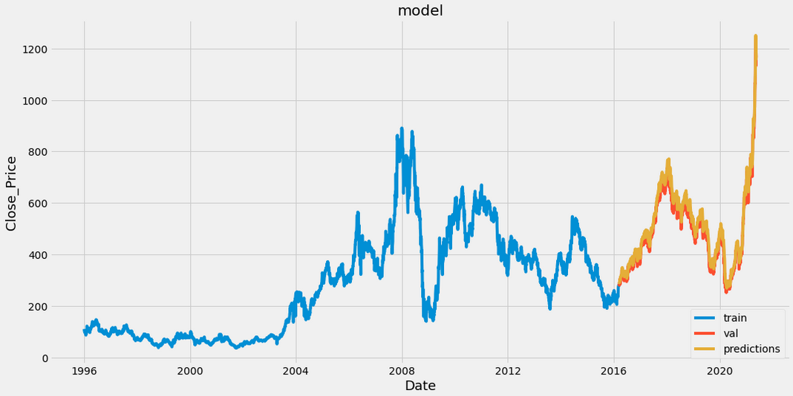
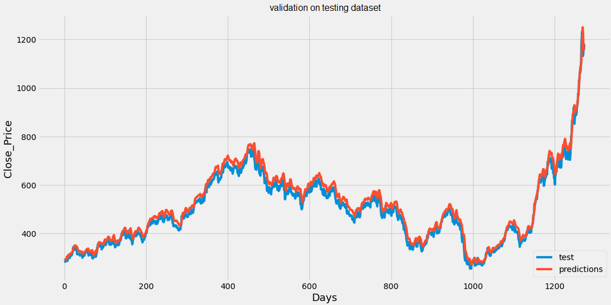

# Stock market price pred
Stock Price Prediction Using Python & Machine Learning (LSTM).
The stock prices are fetched from yfinance which has the data till recent date.
The rmse obtained is : 19.365426259662144 on 'Close' price ranging from (111.868919 in "1996-01-01" to 1164.250000 today)

## Historical price graph

## Model Predictions

## Testing dataset
The predicted value of the 'Close' is very similar to the testing dataset.

##
- The Website Repo: [here](https://github.com/shhubhxm/StockMarketPrediction_StreamlitApp)
- Streamlit App: [here](https://share.streamlit.io/devsavsani/stockmarketprediction_streamlitapp/main/app.py)
